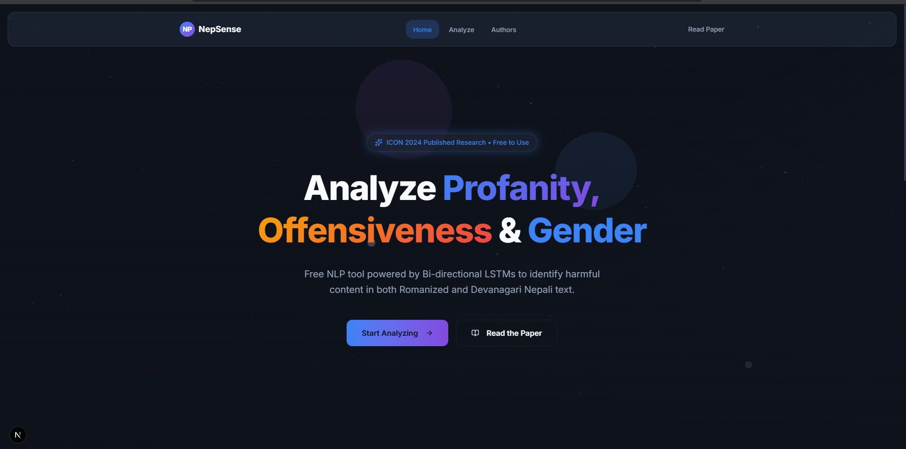

<p align="center">
  
  
  
  
  
</p>

<h1 align="center">🛡️ NepSense</h1>

<h3 align="center">
  <em>Profanity & Offensiveness Detection for Nepali Language</em>
</h3>

<p align="center">
  A full-stack, production-ready web application for detecting <strong>profanity</strong>, <strong>offensiveness</strong>, and <strong>gender</strong> in Nepali text using state-of-the-art Bi-directional LSTM models.
</p>

<p align="center">
  <a href="https://aclanthology.org/2024.icon-1.60"><strong>📄 Read the Paper</strong></a> ·
  <a href="#-live-demo"><strong>🚀 Try the Demo</strong></a> ·
  <a href="#-getting-started"><strong>🏁 Get Started</strong></a> ·
  <a href="#-api-reference"><strong>📚 API Docs</strong></a>
</p>

---

## ✨ Highlights

<table>
  <tr>
    <td align="center" width="33%">
      <h3>🎯 95%+</h3>
      <p>Detection Accuracy</p>
    </td>
    <td align="center" width="33%">
      <h3>⚡ &lt;50ms</h3>
      <p>Inference Speed</p>
    </td>
    <td align="center" width="33%">
      <h3>🆓 Free</h3>
      <p>Forever</p>
    </td>
  </tr>
</table>

---

## 🧠 What is NepSense?

**NepSense** is an NLP-powered tool that analyzes Nepali text to detect harmful content. It's based on peer-reviewed research published at **ICON 2024** (21st International Conference on Natural Language Processing).

### Key Capabilities

| Feature | Description |
|---------|-------------|
| **🛡️ Triple Detection** | Simultaneously detect profanity, offensiveness, and speaker gender |
| **🔤 Hybrid Input** | Works with both Devanagari (नेपाली) and Romanized (Nepali) text |
| **🧬 Bi-LSTM Architecture** | Deep learning models that capture contextual meaning, not just keywords |
| **🌐 Transliteration** | Automatic conversion of Romanized text to Devanagari using AI4Bharat |
| **🚀 Production Ready** | FastAPI backend with rate limiting, caching, and containerized deployment |

---

## � Screenshots

<p align="center">
  
</p>

---

## 🏗️ Architecture

```
┌─────────────────────────────────────────────────────────────────┐
│                        Frontend (Next.js 16)                     │
│  ┌─────────────┐  ┌─────────────┐  ┌─────────────┐              │
│  │   Landing   │  │    Demo     │  │   Authors   │              │
│  │    Page     │  │    Page     │  │    Page     │              │
│  └─────────────┘  └─────────────┘  └─────────────┘              │
│                                                                  │
│  • React 19 • Framer Motion • Three.js • TailwindCSS v4         │
└──────────────────────────┬──────────────────────────────────────┘
                           │ REST API
                           ▼
┌─────────────────────────────────────────────────────────────────┐
│                       Backend (FastAPI)                          │
│  ┌─────────────────────────────────────────────────────────┐    │
│  │                    Model Manager                         │    │
│  │  ┌──────────────┐  ┌──────────────┐  ┌──────────────┐   │    │
│  │  │ Bi-LSTM      │  │ Bi-LSTM      │  │ Multilabel   │   │    │
│  │  │ Profane      │  │ Offensive    │  │ LSTM         │   │    │
│  │  └──────────────┘  └──────────────┘  └──────────────┘   │    │
│  │  ┌──────────────────────────────────────────────────┐   │    │
│  │  │        Multi-Output BERT (Gender + Prof.)        │   │    │
│  │  └──────────────────────────────────────────────────┘   │    │
│  └─────────────────────────────────────────────────────────┘    │
│                                                                  │
│  • TensorFlow/Keras • PyTorch/Transformers • AI4Bharat Xlit     │
└─────────────────────────────────────────────────────────────────┘
```

---

## 🚀 Live Demo

> **Free to use, no sign-up required!**

👉 **[Try NepSense Now](YOUR_DEPLOYED_URL)**

---

## 🏁 Getting Started

### Prerequisites

| Requirement | Version |
|-------------|---------|
| Python | 3.9+ |
| Node.js | 18+ (LTS) |
| Git | Latest |

### 📥 Installation

#### 1. Clone the Repository

```bash
git clone https://github.com/Tri-Yantra-Technologies/Profanity-And-Offensiveness-Detection-Nepali.git
cd Profanity-And-Offensiveness-Detection-Nepali
```

#### 2. Backend Setup

The backend serves the AI models via a REST API.

```bash
cd backend

# Create and activate virtual environment
python -m venv venv

# Windows:
.\venv\Scripts\activate
# Linux/Mac:
source venv/bin/activate

# Install dependencies
pip install -r requirements.txt

# Start the server
python run_backend.py
```

✅ **Backend running at:** `http://localhost:8000`

#### 3. Frontend Setup

```bash
# Open a new terminal
cd frontend

# Install dependencies
npm install

# Start development server
npm run dev
```

✅ **Frontend running at:** `http://localhost:3000`

---

## 📚 API Reference

Once the backend is running, interactive API docs are available at:

| Documentation | URL |
|--------------|-----|
| **Swagger UI** | `http://localhost:8000/api/docs` |
| **ReDoc** | `http://localhost:8000/api/redoc` |

### Core Endpoints

#### `POST /predict` — Analyze Text

Detect profanity and offensiveness in Nepali text.

**Request:**
```json
{
  "text": "तिमीलाई यो कुरा थाहा छ?",
  "model_type": "profane_binary"
}
```

**Response:**
```json
{
  "profanity": {
    "label": "Non-Profane",
    "confidence": 0.9823
  },
  "offensiveness": {
    "label": "Non-Offensive",
    "confidence": 0.9456
  },
  "latency_ms": 42.5,
  "model_used": "profane_binary"
}
```

#### Available Model Types

| Model Type | Description | Best For |
|------------|-------------|----------|
| `profane_binary` | Binary profanity detection | Detecting swear words and vulgar language |
| `offensive_binary` | Binary offensiveness detection | Detecting disrespectful or insulting content |
| `multilabel` | 3-class classification | Combined analysis (Clean/Offensive/Profane) |
| `multi_output` | BERT-based with gender prediction | Advanced analysis with speaker identification |

#### Other Endpoints

| Method | Endpoint | Description |
|--------|----------|-------------|
| `GET` | `/health` | Health check for load balancers |
| `GET` | `/models` | List available models |
| `GET` | `/meta` | API metadata and rate limits |
| `POST` | `/analyze` | Run all models simultaneously |
| `POST` | `/predict/gender` | Gender prediction only |
| `POST` | `/feedback` | Submit correction feedback |

---

## 🧠 Model Information

### Available Models

All models are located in `backend/pkl/` and are loaded automatically on startup.

| File | Size | Description |
|------|------|-------------|
| `Binomial_LSTM_Profane.h5` | 22 MB | Binary profanity classifier |
| `Binomial_LSTM_Offensive.keras` | 8 MB | Binary offensiveness classifier |
| `Mutlilabel_LSTM_Offensive_Profane.h5` | 42 MB | 3-class combined classifier |
| `Multi_Model_Multi_Output.h5` | 96 MB | BERT-based gender + profanity |

### Technical Details

- **Tokenization:** Custom Keras tokenizers saved as `.pkl` files
- **Max Sequence Length:** 500 tokens
- **Padding:** Post-padding
- **BERT Model:** `bert-base-multilingual-cased` for Multi-Output
- **Transliteration:** AI4Bharat XlitEngine (Romanized → Devanagari)

---

## 🛠️ Tech Stack

### Frontend
| Technology | Purpose |
|------------|---------|
| **Next.js 16** | React framework with App Router |
| **React 19** | UI library |
| **TailwindCSS v4** | Utility-first styling |
| **Framer Motion** | Animations |
| **Three.js** | 3D background effects |
| **Lucide React** | Icons |

### Backend
| Technology | Purpose |
|------------|---------|
| **FastAPI** | High-performance API framework |
| **TensorFlow/Keras** | Deep learning inference |
| **PyTorch/Transformers** | BERT embeddings |
| **AI4Bharat** | Nepali transliteration |
| **Joblib** | Model serialization |
| **Uvicorn** | ASGI server |

---

## 📄 Research Paper

This project is the implementation of our research published at **ICON 2024**:

> **Profanity and Offensiveness Detection in Nepali Language Using Bi-directional LSTM Models**
>
> *Abiral Adhikari, Prashant Manandhar, Reewaj Khanal, Samir Wagle, Praveen Acharya, Bal Krishna Bal*
>
> Proceedings of the 21st International Conference on Natural Language Processing (ICON), December 2024
> NLP Association of India (NLPAI), Chennai, India

📖 **[Read the full paper on ACL Anthology](https://aclanthology.org/2024.icon-1.60)**

### Abstract

> Offensive and profane content has been on the rise in Nepali Social Media, which is very disturbing to users. This is partly due to the absence of proper tools and mechanisms for the Nepali language to deal with profanity and offensive texts. In this work, we attempt to develop a deep learning-based profanity and offensive comments detection tool. We develop a Bi-LSTM (Bidirectional Long Short Term Memory) based model for the classification of Profane and Offensive comments and study different variations of the task. Furthermore, Multilingual BERT embedding and vocab embedding were used among others for an accurate understanding of the intent and decency of the posts. While previous related studies in the Nepali language are more focused on sentiment and offensiveness detection only, our study explores profanity and offensiveness detection as two distinct tasks.

### Citation

```bibtex
@inproceedings{adhikari-etal-2024-profanity,
    title = "Profanity and Offensiveness Detection in {N}epali Language Using Bi-directional {LSTM} Models",
    author = "Adhikari, Abiral and Manandhar, Prashant and Khanal, Reewaj and Wagle, Samir and Acharya, Praveen and Bal, Bal Krishna",
    editor = "Lalitha Devi, Sobha and Arora, Karunesh",
    booktitle = "Proceedings of the 21st International Conference on Natural Language Processing (ICON)",
    month = dec,
    year = "2024",
    address = "AU-KBC Research Centre, Chennai, India",
    publisher = "NLP Association of India (NLPAI)",
    url = "https://aclanthology.org/2024.icon-1.60/",
    pages = "515--521"
}
```

---

## 👥 Authors

<table>
  <tr>
    <td align="center">
      <a href="https://www.researchgate.net/profile/Abiral-Adhikari-4">
        <strong>Abiral Adhikari</strong>
      </a>
    </td>
    <td align="center">
      <a href="https://manandharprashant.com.np">
        <strong>Prashant Manandhar</strong>
      </a>
    </td>
    <td align="center">
      <a href="https://reewajkhanal.com.np">
        <strong>Reewaj Khanal</strong>
      </a>
    </td>
  </tr>
  <tr>
    <td align="center">
      <a href="https://samirwagle.com.np">
        <strong>Samir Wagle</strong>
      </a>
    </td>
    <td align="center">
      <a href="https://aclanthology.org/people/praveen-acharya/">
        <strong>Praveen Acharya</strong>
      </a>
    </td>
    <td align="center">
      <a href="https://aclanthology.org/people/bal-krishna-bal/">
        <strong>Bal Krishna Bal</strong>
      </a>
    </td>
  </tr>
</table>

---

## � Docker Deployment

### Build and Run

```bash
# Backend
cd backend
docker build -t nepsense-backend .
docker run -p 8000:8000 nepsense-backend

# Frontend (production build)
cd frontend
npm run build
npm start
```

### Environment Variables

Create `.env` files in both `backend/` and `frontend/` directories:

**Backend (`backend/.env`):**
```env
FRONTEND_ORIGIN=http://localhost:3000
RATE_LIMIT_REQUESTS=100
RATE_LIMIT_WINDOW=60
```

**Frontend (`frontend/.env`):**
```env
NEXT_PUBLIC_API_URL=http://localhost:8000
```

---

## 🤝 Contributing

Contributions are welcome! Here's how you can help:

1. **Fork** the repository
2. **Create** a feature branch (`git checkout -b feature/amazing-feature`)
3. **Commit** your changes (`git commit -m 'Add amazing feature'`)
4. **Push** to the branch (`git push origin feature/amazing-feature`)
5. **Open** a Pull Request

### Development Guidelines

- Follow existing code style
- Add tests for new features
- Update documentation as needed
- Ensure all tests pass before submitting

---

## 📝 License

This project is licensed under the **MIT License** — see the [LICENSE](LICENSE) file for details.

**Free for:**
- ✅ Personal use
- ✅ Academic research
- ✅ Commercial applications
- ✅ Modification and distribution

---

## 🙏 Acknowledgments

- **[AI4Bharat](https://ai4bharat.org/)** for the Hindi-Nepali transliteration engine
- **[Hugging Face](https://huggingface.co/)** for BERT model hosting
- **[NLP Association of India (NLPAI)](https://nlp-ai.org/)** for organizing ICON 2024
- The research community for advancing NLP in low-resource languages

---

<p align="center">
  <strong>Made with ❤️ for the Nepali NLP Community</strong>
</p>

<p align="center">
  <a href="https://aclanthology.org/2024.icon-1.60">Paper</a> ·
  <a href="https://github.com/Tri-Yantra-Technologies/Profanity-And-Offensiveness-Detection-Nepali/issues">Report Bug</a> ·
  <a href="https://github.com/Tri-Yantra-Technologies/Profanity-And-Offensiveness-Detection-Nepali/issues">Request Feature</a>
</p>
